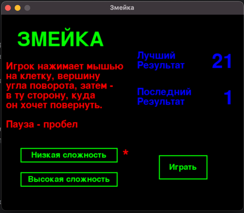
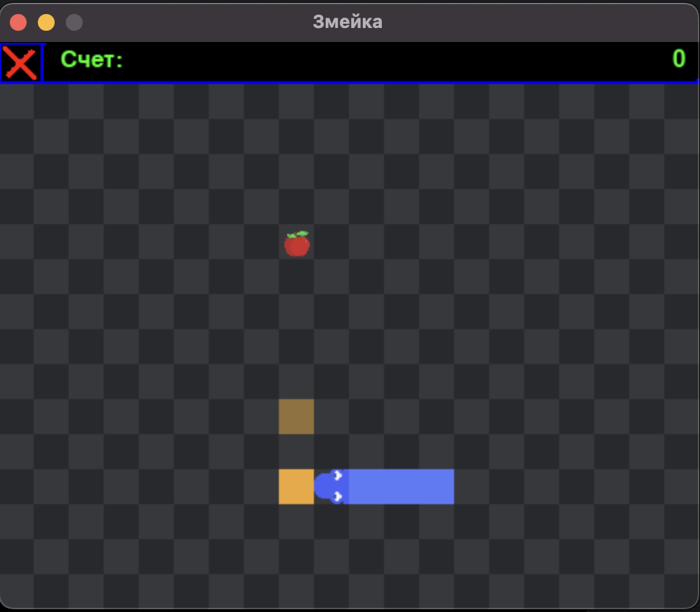
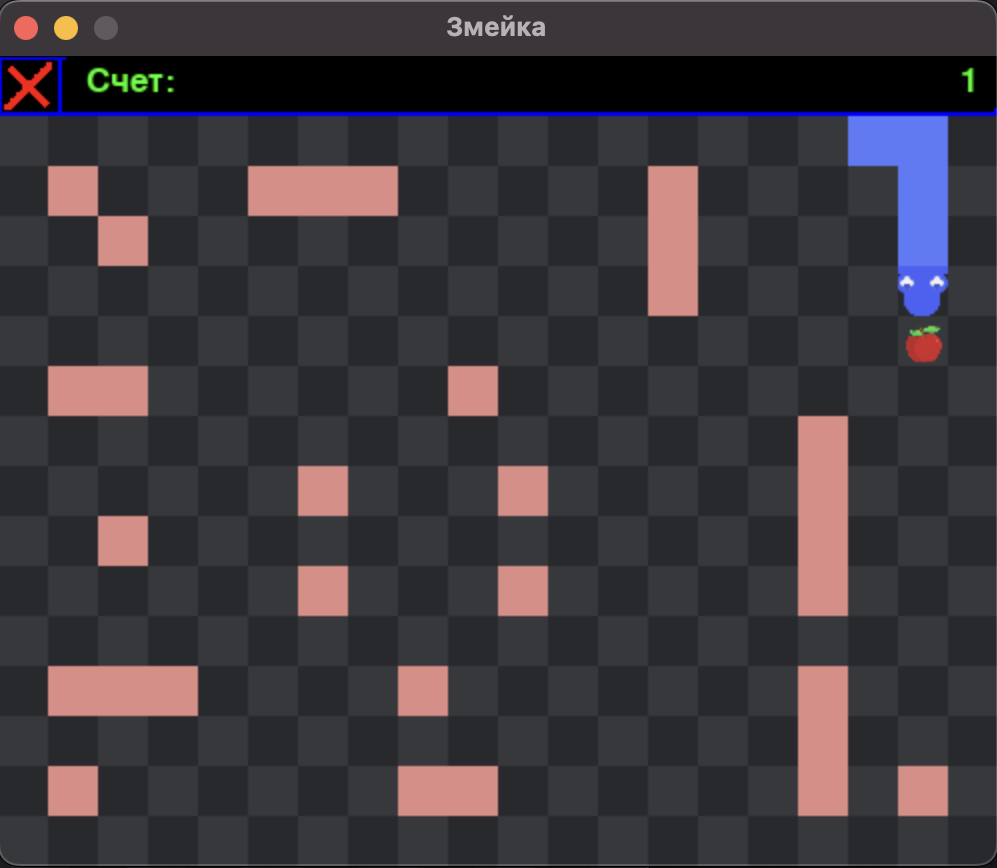
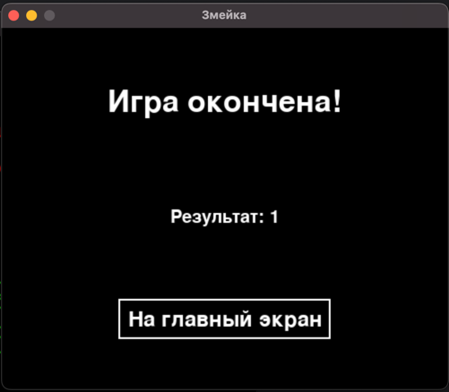

# PySnake - змейка на pygame

## Описание

Игра, в которой персонаж, управляемый игроком, — змейка — стремится набрать максимальное количество очков,
поедая яблоки. Игра происходит на клетчатом поле и продолжается до победы (для этого нужно заполнить змейкой весь экран)
или поражения
(оно случается, когда змейка сталкивается с границей поля, препятствием или самой собой). В базе данных хранятся лучший
и последний результаты. Предусмотрены два уровня сложности. Управление осуществляется мышью.

## Техническое задание

### Игра

- [x] Начальный экран:
    - [x] Информация об игре
    - [x] Лучший результат, последний результат
    - [x] Выбор уровня сложности (карты)
    - [x] Кнопка начала игры
    - [x] Получение данных с БД
- [x] Игра:
    - [x] Два уровня
    - [x] Счет
    - [x] Игровое поле
    - [x] Змейка
    - [x] Яблоки
    - [x] Движение змейки
    - [x] Управление мышью
    - [x] Обработка окончания игры
    - [x] Кнопка закрытия игры
    - [x] Пауза по нажатии пробела
- [x] Финальный экран
    - [x] Результат последней игры
    - [x] Обновление данных в БД
    - [x] Кнопка возврата на начальный экран

### База данных

- [x] Таблица с колонками last_score, best_score

# Пояснительная записка

Название игры - Змейка. Автор - Варламов Никита Денисович, преподаватель - Бушенев Игорь Владимирович.

## Идея

Игра, в которой на клетчатом поле находится змейка, стремящаяся набрать максимальное количество очков, поедая
яблоки. Управление осуществляется мышью: игрок нажатиями ЛКМ кнопки указывает место и угол поворота змейки. Победа
происходит, когда змейка заполняет весь экран, а поражение случается, когда змейка сталкивается с границей поля,
препятствием или самой собой.

## Технологии и инструменты

Код написан на Python 3 с использованием библиотеки Pygame. Присутствует работа с базой данных: движок СУБД - sqlite, в
коде используется библиотека sqlite3. Для быстрой установки всех зависимостей нужной версии есть файл
requirements.txt.

## Структура проекта

Основной игровой цикл реализован через три функции, оборачивающие начальный экран, собственно, игру и финальный экран.
Они друг друга вызывают, что похоже на рекурсию.

Каждый экран - экземпляр собственного класса, обрабатывающий события и рисующий на окне приложения. Код с этими классами
разнесен по разным файлам. Помимо этого, в отдельные файлы вынесены функции, реализующие работу с базой данных, и те,
что часто используются внутри программы. Карта уровня сложности с препятствиями хранится в текстовом файле.

Игровое поле рисуется и обрабатывается классом Board, где оно хранится в виде двумерного массива с игровыми объектами:
Apple, Head, BodyPart, AngleTopTile, AngleGoToTile и Obstacle. Элементы интерфейса (счет, текст, кнопки) - это классы,
унаследованный от базового спрайта.

## База данный

База данных используется для хранения последнего и лучшего результатов. Создается таблица с одной строкой и двумя
колонками

## Скриншоты

[Ссылка на презентацию](https://docs.google.com/presentation/d/1_HK9WNmuBeKbmQX8QtlA5aY31sI66fwx9j9TipN0ZTk/edit?usp=sharing)
